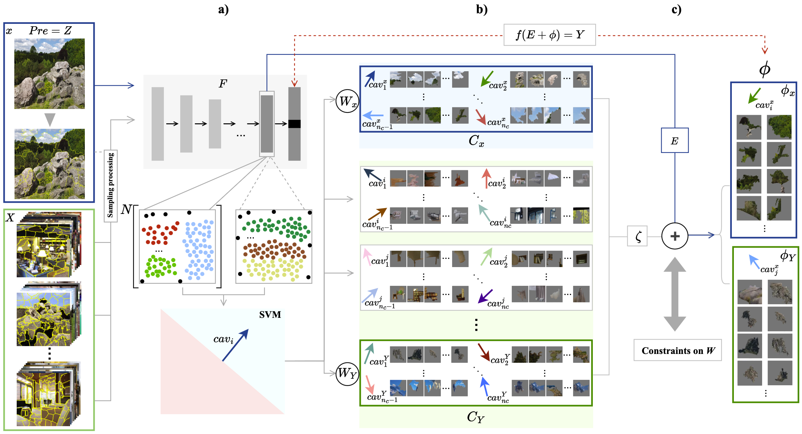
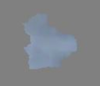

# Conceptual Constraint Perturbation: Unveiling the Causes of Model Misclassifications in Deep Neural Networks

# What is this work about?


Understanding model mistakes is critical to many machine learning objectives yet this is still an ad hoc process that involves manually looking at the model’s mistakes on many test samples and guessing the underlying reasons for those incorrect predictions. With CCP, we would like to take a step towards systematically analyzing model mistakes using high-level human understandable terms, i.e. concepts!


# How to generate conceptual counterfactuals?

## The architecture of our method
 <br>

## Learning a concept bank
In practice, we set two concept libraries - samples and training sets. If you wish to train your own concept banks, you can use the script `learn_concepts.py`. 

`````
python3 learn_concepts.py --image ./image/input_image.jpg --train-dir ./image/label_dataset --output-dir ./Concept_base
`````
For details, please refer to the `learn_concepts.py` script and/or our paper.

## Generate constrained perturbations
Given a concept bank and a model, you can run `CCP.py` to generate the explanations. For instance, the command <br>
`````
python3 CCP.py --model-path /your_model_path --concept-bank Concept_base/your_concept_base.pth --device cpu --image-folder ./images --explanation-folder ./Explanation --pos-samples-folder ./positive_samples --neg-samples-folder ./negative_samples --n-samples 50 --C 0.001 0.01 0.1 1.0
`````
For the examples that we share, upon running the command above, the output image should look like the following: <br>

Input image:<br>
 <br>
Output interpretation (the number of superpixels can be customized):<br>
 <br>


# Contact
If you have any concerns or questions, please reach out to me at `sunzeyang1@stu.sau.edu.cn`. 


